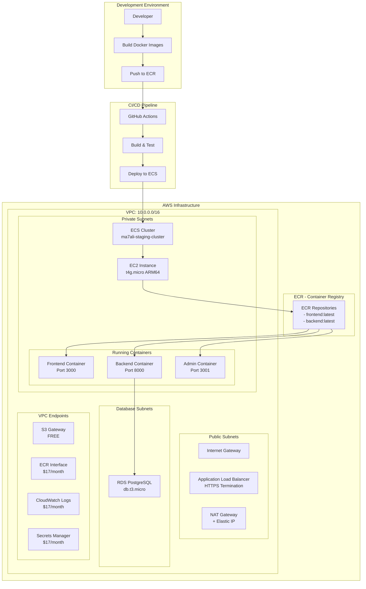
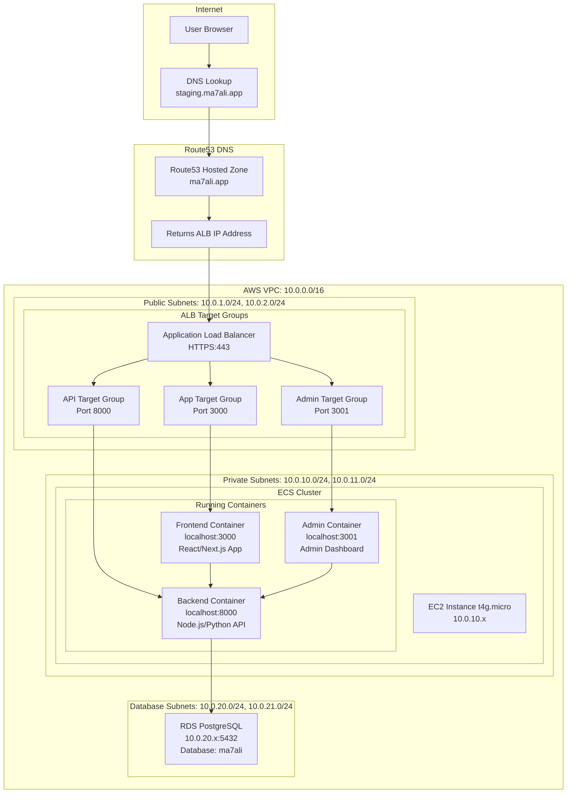

# Ma7ali Infrastructure

> **Learning Project**: This infrastructure was built as a comprehensive learning exercise to understand AWS services, Terraform modules, and cost-optimized cloud architecture design.

A secure, production-ready AWS infrastructure built with Terraform for the Ma7ali application, featuring cost-optimized ECS container orchestration, hybrid networking, and comprehensive security controls.

## 🎯 Project Goals & Learning Outcomes

This project demonstrates:
- **Modular Infrastructure**: Reusable Terraform modules for scalable architecture
- **Cost Optimization**: Strategic decisions to minimize AWS costs while maintaining functionality
- **Security Best Practices**: Comprehensive IAM, encryption, and network security
- **Container Orchestration**: ECS with EC2 for cost-effective container management
- **Hybrid Networking**: VPC endpoints + NAT Gateway for optimal performance and cost

## 💰 Cost Optimization Strategy

We achieved significant cost savings through strategic architectural decisions:

### **ECS vs EKS Decision**
- **EKS Cost**: ~$73+ per month (control plane + nodes)
- **ECS Cost**: ~$10-15 per month (no control plane charges)
- **Savings**: ~$60+ per month (80% cost reduction)

### **Key Cost Optimizations**
| Optimization | Monthly Savings | Description |
|--------------|-----------------|-------------|
| **ARM64 Instances** | $3-8 | t4g.micro ARM64 (20-40% cheaper than x86) |
| **Fargate Spot** | $15-30 | Up to 70% cheaper than regular Fargate |
| **Scale-to-Zero** | $10-20 | Auto Scaling Group min_size = 0 |
| **VPC Endpoints** | $10-25 | Avoid NAT Gateway charges for AWS services |
| **Short Log Retention** | $5-15 | 7 days vs 14+ days for production |
| **Container Insights Disabled** | $10-30 | Monitoring cost savings in staging |
| **Single-AZ RDS** | $15-25 | No Multi-AZ for staging environment |

### **Total Estimated Monthly Cost: ~$159**
- **ECS Infrastructure**: $10/month (EC2 + Auto Scaling)
- **Networking**: $108/month (VPC Endpoints $70 + NAT Gateway $38)
- **Database**: $18/month (RDS db.t3.micro)
- **Load Balancing**: $20/month (Application Load Balancer)
- **Supporting Services**: $3/month (KMS, Secrets, Route53)

*Cost estimates generated using [Infracost](https://www.infracost.io/) tool*

## 🏗️ Architecture Overview

### **High-Level Architecture**
```
┌─────────────────────────────────────────────────────────┐
│                    Internet Users                       │
└─────────────────────┬───────────────────────────────────┘
                      │
┌─────────────────────▼───────────────────────────────────┐
│                 Route53 DNS                             │
└─────────────────────┬───────────────────────────────────┘
                      │
┌─────────────────────▼───────────────────────────────────┐
│              Application Load Balancer                  │
│                 (Public Subnets)                        │
└─────────────────────┬───────────────────────────────────┘
                      │
┌─────────────────────▼───────────────────────────────────┐
│                ECS Containers                           │
│              (Private Subnets)                          │
│  ┌─────────────┐ ┌─────────────┐ ┌─────────────┐       │
│  │  Frontend   │ │   Backend   │ │    Admin    │       │
│  │   :3000     │ │    :8000    │ │    :3001    │       │
│  └─────────────┘ └─────────────┘ └─────────────┘       │
└─────────────────────┬───────────────────────────────────┘
                      │
┌─────────────────────▼───────────────────────────────────┐
│              RDS PostgreSQL                             │
│              (Database Subnets)                         │
└─────────────────────────────────────────────────────────┘
```

### **Network Architecture**
- **VPC**: 10.0.0.0/16 with DNS support
- **Public Subnets**: 10.0.1.0/24, 10.0.2.0/24 (ALB, NAT Gateway)
- **Private Subnets**: 10.0.10.0/24, 10.0.11.0/24 (ECS tasks)
- **Database Subnets**: 10.0.20.0/24, 10.0.21.0/24 (RDS)

### **Why This Architecture?**

1. **Security**: Multi-tier architecture with isolated subnets
2. **Cost**: Hybrid networking (VPC endpoints + NAT) optimizes data transfer costs
3. **Performance**: VPC endpoints provide direct AWS backbone access
4. **Scalability**: Auto Scaling Groups can scale 0-5 instances based on demand
5. **Reliability**: Multi-AZ deployment with health checks

## 📁 Modular Project Structure

Each component is built as a reusable Terraform module with its own README:

```
infra/
├── README.md                    # This comprehensive guide
├── docker-compose.yml           # LocalStack for local testing
├── Makefile                     # Root-level commands
├── environments/
│   └── staging/                 # Staging environment configuration
│       ├── ecs.tf              # ECS cluster & EC2 capacity
│       ├── ecs_task_definitions.tf # Container definitions
│       ├── ssm.tf              # Centralized secrets management
│       ├── vpc.tf              # VPC with endpoints
│       ├── alb.tf              # Application Load Balancer
│       ├── rds.tf              # PostgreSQL database
│       ├── route53.tf          # DNS management
│       └── [other config files]
└── modules/                     # Reusable infrastructure modules
    ├── ecs/                    # ECS cluster management
    ├── ecs_ec2/                # EC2 capacity provider
    ├── ssm/                    # Secrets Manager
    ├── vpc/                    # VPC with endpoints
    ├── alb/                    # Application Load Balancer
    ├── rds/                    # PostgreSQL database
    ├── s3/                     # Object storage
    ├── kms/                    # Key management
    ├── iam_groups/             # IAM group management
    ├── iam_policies/           # IAM policy management
    └── iam_users/              # IAM user management
```

**Each module includes:**
- `main.tf` - Core resource definitions
- `variables.tf` - Input parameters with validation
- `outputs.tf` - Return values for other modules
- `README.md` - Comprehensive documentation and examples

## 👥 IAM Security Model

### **IAM Users & Access Levels**
| User | Access Level | Use Case |
|------|--------------|----------|
| **admin** | Full administrative access | Infrastructure management, emergency access |
| **developer** | Read/write to S3, KMS, ECS | Application deployment, development tasks |
| **viewer** | Read-only access | Monitoring, auditing, reporting |

### **IAM Groups & Policies**
- **MFA Enforcement**: All groups require Multi-Factor Authentication
- **Least Privilege**: Granular policies with specific resource scoping
- **Environment Isolation**: Policies scoped to staging environment
- **Service-Specific Groups**: Separate groups for S3, KMS, ECS, RDS, VPC management

### **Service Roles**
- **ECS Task Execution Role**: Pull images, publish logs, fetch secrets
- **ECS Task Role**: Application permissions (S3, Secrets Manager)
- **ECS Instance Role**: EC2 instances joining ECS cluster
- **GitHub Actions Role**: OIDC-based CI/CD deployment

## 🔒 Security Features

### **Current Security Measures**
- ✅ **Network Isolation**: Private subnets for applications, isolated database subnets
- ✅ **Encryption at Rest**: KMS encryption for RDS, Secrets Manager, CloudWatch Logs
- ✅ **Encryption in Transit**: HTTPS/TLS for all external communication
- ✅ **IAM Best Practices**: Least privilege, MFA enforcement, role-based access
- ✅ **VPC Flow Logs**: Network traffic monitoring and analysis
- ✅ **Security Group Rules**: Restrictive ingress/egress with documented exceptions
- ✅ **Secrets Management**: Centralized credential storage with KMS encryption

### **Production Security Enhancements**
For production deployment, implement these additional security measures:

#### **🔐 Enhanced Security Controls**
- [ ] **AWS Config**: Compliance monitoring and configuration drift detection
- [ ] **CloudTrail**: Comprehensive API logging and audit trails
- [ ] **GuardDuty**: Threat detection and security monitoring
- [ ] **WAF**: Web Application Firewall for ALB protection
- [ ] **Inspector**: Vulnerability assessment for EC2 instances
- [ ] **Macie**: Data classification and protection for S3

#### **🛡️ Network Security**
- [ ] **Private ECR**: VPC-only access to container registry
- [ ] **VPC Flow Logs Analysis**: Automated anomaly detection
- [ ] **Network ACLs**: Additional subnet-level security controls
- [ ] **PrivateLink**: Direct connections to AWS services

#### **🔑 Access Control**
- [ ] **AWS SSO**: Centralized identity management
- [ ] **Cross-Account Roles**: Separate AWS accounts for environments
- [ ] **Certificate Manager**: Automated SSL certificate management
- [ ] **Secrets Rotation**: Automatic credential rotation policies

## 🚀 Production Readiness Checklist

### **Infrastructure Changes for Production**
- [ ] **Multi-AZ RDS**: Enable for high availability (`multi_az = true`)
- [ ] **Container Insights**: Enable for comprehensive monitoring
- [ ] **Enhanced Monitoring**: Increase log retention to 30+ days
- [ ] **Auto Scaling**: Increase max_size and adjust target capacity
- [ ] **Backup Strategy**: Implement automated RDS and EFS backups
- [ ] **Disaster Recovery**: Cross-region replication and failover procedures

### **Performance Optimizations**
- [ ] **Instance Sizing**: Right-size based on actual usage patterns
- [ ] **Database Performance**: Enable Performance Insights and tuning
- [ ] **CDN**: CloudFront distribution for static assets
- [ ] **Caching**: ElastiCache for application-level caching
- [ ] **Load Balancer**: Optimize ALB configuration for production traffic

### **Operational Excellence**
- [ ] **Monitoring Dashboards**: CloudWatch dashboards and alarms
- [ ] **Log Aggregation**: Centralized logging with ELK stack or similar
- [ ] **Alerting**: PagerDuty or SNS-based incident management
- [ ] **CI/CD Pipeline**: Automated testing and deployment workflows
- [ ] **Infrastructure as Code**: GitOps workflow for infrastructure changes

## 🧪 Local Development & Testing

### **LocalStack Integration**
We use [LocalStack](https://localstack.cloud/) for local AWS service emulation:

```bash
# Start LocalStack services
make up

# Run infrastructure locally
cd environments/staging
make init
make plan
make apply
```

**Supported Services:**
- S3, IAM, STS, EC2, ECS, ECR
- RDS, KMS, Logs, Secrets Manager
- Route53, ACM, Elastic Load Balancing

### **Development Workflow**
```bash
# Daily development cycle
make up          # Start LocalStack
make plan        # Preview changes
make apply       # Apply infrastructure
make security    # Security scanning
make cost        # Cost estimation
```

## 📊 Cost Monitoring & Management

### **Cost Estimation Tools**
- **Infracost**: Automated cost estimation in CI/CD
- **AWS Cost Explorer**: Real-time cost monitoring
- **CloudWatch Billing**: Cost and usage alarms

### **Cost Control Measures**
- **Resource Tagging**: Comprehensive cost allocation tags
- **Auto Scaling**: Scale-to-zero capability for non-production
- **Scheduled Scaling**: Time-based scaling for predictable workloads
- **Spot Instances**: Cost-effective compute for fault-tolerant workloads

## 🌐 Deployment Architecture

### **Deployment Flow Diagram**


### **User Request Flow Diagram**


## 🚀 Quick Start Guide

### **Prerequisites**
- [Terraform](https://www.terraform.io/downloads.html) >= 1.0
- [Docker](https://docs.docker.com/get-docker/) and Docker Compose
- [AWS CLI](https://aws.amazon.com/cli/) configured
- [Infracost CLI](https://www.infracost.io/docs/) for cost estimation

### **Local Development Setup**
```bash
# 1. Clone the repository
git clone <repository-url>
cd infra

# 2. Start LocalStack for local testing
make up

# 3. Initialize Terraform
cd environments/staging
make init

# 4. Plan infrastructure changes
make plan

# 5. Apply infrastructure (to LocalStack)
make apply

# 6. Run security scan
make security

# 7. Estimate costs
make cost
```

### **AWS Deployment**
```bash
# 1. Configure AWS credentials
aws configure

# 2. Update terraform.tfvars with your values
cp terraform.tfvars.example terraform.tfvars
# Edit terraform.tfvars with your domain, region, etc.

# 3. Deploy to AWS
make plan-aws    # Preview changes for AWS
make apply-aws   # Deploy to actual AWS account

# 4. Build and push application images
# (Your application build process)
docker build -t your-account.dkr.ecr.region.amazonaws.com/frontend .
docker push your-account.dkr.ecr.region.amazonaws.com/frontend

# 5. Access your application
# https://staging.your-domain.com
# https://api.staging.your-domain.com
# https://admin.staging.your-domain.com
```

## 🧪 Testing & Validation

### **Planned AWS Deployment Test**
This infrastructure will be deployed to an actual AWS account for comprehensive testing:

- **Functionality Testing**: Verify all services work end-to-end
- **Performance Testing**: Load testing and optimization
- **Security Testing**: Penetration testing and vulnerability assessment
- **Cost Validation**: Actual cost monitoring vs estimates
- **Disaster Recovery**: Backup and restore procedures

### **Testing Checklist**
- [ ] **Container Deployment**: ECS services start and register healthy
- [ ] **Load Balancer**: ALB routes traffic correctly to containers
- [ ] **Database Connectivity**: Applications can connect to RDS
- [ ] **Secrets Management**: Containers can fetch credentials
- [ ] **External APIs**: Applications can call external services via NAT
- [ ] **Monitoring**: CloudWatch logs and metrics are collected
- [ ] **Auto Scaling**: ECS scales based on demand
- [ ] **Health Checks**: Unhealthy containers are replaced

## 📚 Additional Resources

### **Module Documentation**
Each module includes comprehensive README files:
- [ECS Module](modules/ecs/README.md) - Container orchestration
- [ECS EC2 Module](modules/ecs_ec2/README.md) - EC2 capacity provider
- [SSM Module](modules/ssm/README.md) - Secrets management
- [VPC Module](modules/vpc/README.md) - Network infrastructure
- [ALB Module](modules/alb/README.md) - Load balancing
- [RDS Module](modules/rds/README.md) - Database management

### **Useful Commands**
```bash
# Infrastructure Management
make plan          # Preview changes
make apply         # Apply changes
make destroy       # Destroy infrastructure
make security      # Security scan
make cost          # Cost estimation

# LocalStack Management
make up            # Start LocalStack
make down          # Stop LocalStack
make logs          # View LocalStack logs
make restart       # Restart LocalStack

# Code Quality
make fmt           # Format Terraform code
make validate      # Validate configuration
make lint          # Lint code
```

## 🤝 Contributing

This is a learning project, but contributions and suggestions are welcome:

1. Fork the repository
2. Create a feature branch
3. Make your changes
4. Run tests and security scans
5. Submit a pull request

## 📄 License

This project is for educational purposes. See LICENSE file for details.

---

**Built with ❤️ for learning AWS infrastructure, Terraform best practices, and cost-optimized cloud architecture.**