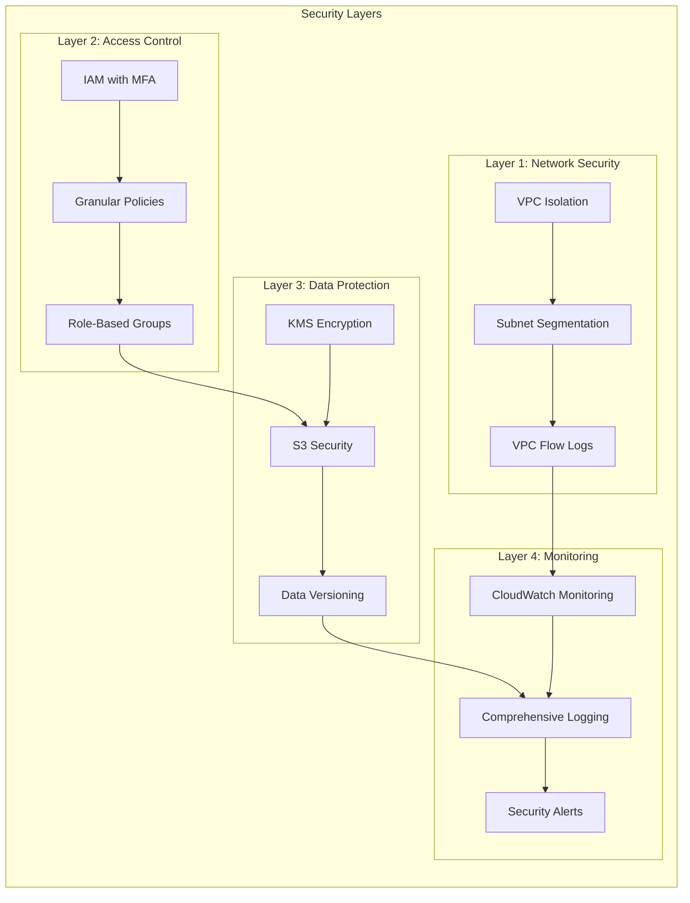
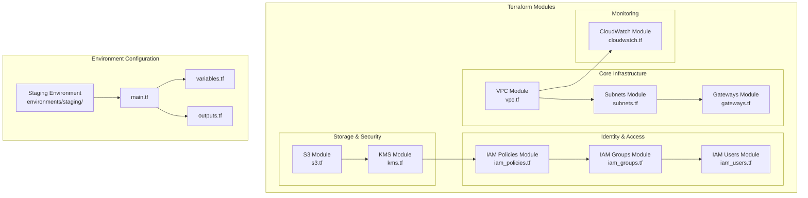

# Ma7ali Infrastructure Architecture Diagram

## 🏗️ Complete Infrastructure Overview

```mermaid
graph TB
    %% AWS Account Level
    subgraph "AWS Account (ma7ali-staging)"
        
        %% VPC and Networking
        subgraph "VPC (10.0.0.0/16)"
            VPC[VPC<br/>ma7ali-staging-vpc<br/>DNS Enabled]
            
            %% Availability Zones
            subgraph "us-west-2a"
                subgraph "Public Subnets"
                    PUB1[Public Subnet 1<br/>10.0.1.0/24<br/>ALB Purpose<br/>Auto-assign Public IP]
                end
                
                subgraph "Private Subnets"
                    PRIV1[Private Subnet 1<br/>10.0.10.0/24<br/>EKS Purpose]
                end
                
                subgraph "Database Subnets"
                    DB1[Database Subnet 1<br/>10.0.20.0/24<br/>RDS Purpose]
                end
            end
            
            subgraph "us-west-2b"
                subgraph "Public Subnets"
                    PUB2[Public Subnet 2<br/>10.0.2.0/24<br/>ALB Purpose<br/>Auto-assign Public IP]
                end
                
                subgraph "Private Subnets"
                    PRIV2[Private Subnet 2<br/>10.0.11.0/24<br/>EKS Purpose]
                end
                
                subgraph "Database Subnets"
                    DB2[Database Subnet 2<br/>10.0.21.0/24<br/>RDS Purpose]
                end
            end
            
            %% Gateways
            IGW[Internet Gateway<br/>ma7ali-staging-igw]
            
            %% Flow Logs
            FLOW[VPC Flow Logs<br/>CloudWatch Integration]
        end
        
        %% Storage Layer
        subgraph "Storage & Encryption"
            S3[S3 Bucket<br/>ma7ali-staging-random<br/>Versioning Enabled<br/>KMS Encrypted<br/>Access Logging<br/>Public Access Blocked]
            
            subgraph "KMS Keys"
                KMS_MAIN[Main KMS Key<br/>alias/main-key-staging<br/>Key Rotation<br/>Proper Policies]
                KMS_S3[S3 KMS Key<br/>S3 Encryption<br/>Dedicated Key]
            end
        end
        
        %% IAM Security Layer
        subgraph "IAM Security (MFA Enforced)"
            subgraph "IAM Groups"
                ADMIN_GROUP[Admin Group<br/>MFA Required<br/>Full Access]
                DEV_GROUP[Developer Group<br/>MFA Required<br/>Read/Write Access]
                VIEWER_GROUP[Viewer Group<br/>MFA Required<br/>Read-Only Access]
                
                subgraph "Service-Specific Groups"
                    S3_ADMIN[S3 Admin Group<br/>MFA Required]
                    S3_DEV[S3 Developer Group<br/>MFA Required]
                    S3_VIEWER[S3 Viewer Group<br/>MFA Required]
                    
                    KMS_ADMIN[KMS Admin Group<br/>MFA Required]
                    KMS_DEV[KMS Developer Group<br/>MFA Required]
                    KMS_VIEWER[KMS Viewer Group<br/>MFA Required]
                    
                    VPC_ADMIN[VPC Admin Group<br/>MFA Required]
                    VPC_DEV[VPC Developer Group<br/>MFA Required]
                    VPC_VIEWER[VPC Viewer Group<br/>MFA Required]
                    
                    CW_ADMIN[CloudWatch Admin Group<br/>MFA Required]
                    CW_DEV[CloudWatch Developer Group<br/>MFA Required]
                    CW_VIEWER[CloudWatch Viewer Group<br/>MFA Required]
                end
            end
            
            subgraph "IAM Users"
                ADMIN_USER[Admin User<br/>Full Administrative Access]
                DEV_USER[Developer User<br/>Developer-Level Access]
                VIEWER_USER[Viewer User<br/>Read-Only Access]
            end
            
            subgraph "IAM Policies"
                S3_ADMIN_POLICY[S3 Admin Policy<br/>Full S3 Access]
                S3_DEV_POLICY[S3 Developer Policy<br/>Read/Write Access]
                S3_VIEWER_POLICY[S3 Viewer Policy<br/>Read-Only Access]
                
                KMS_ADMIN_POLICY[KMS Admin Policy<br/>Full KMS Access]
                KMS_DEV_POLICY[KMS Developer Policy<br/>Encrypt/Decrypt Access]
                KMS_VIEWER_POLICY[KMS Viewer Policy<br/>Read-Only Access]
                
                VPC_ADMIN_POLICY[VPC Admin Policy<br/>Full VPC Access]
                VPC_DEV_POLICY[VPC Developer Policy<br/>Read Access]
                VPC_VIEWER_POLICY[VPC Viewer Policy<br/>Read-Only Access]
                
                CW_ADMIN_POLICY[CloudWatch Admin Policy<br/>Full CW Access]
                CW_DEV_POLICY[CloudWatch Developer Policy<br/>Read/Write Access]
                CW_VIEWER_POLICY[CloudWatch Viewer Policy<br/>Read-Only Access]
            end
        end
        
        %% Monitoring & Logging
        subgraph "Monitoring & Logging"
            CW_LOGS[CloudWatch Log Groups<br/>KMS Encrypted<br/>Retention Policies]
            
            subgraph "Log Groups"
                APP_LOGS[Application Logs<br/>/aws/application/ma7ali-staging]
                FLOW_LOGS[VPC Flow Logs<br/>/aws/vpc/flow-logs/ma7ali-staging]
            end
        end
        
        %% Security & Compliance
        subgraph "Security & Compliance"
            SECURITY[Security Features<br/>MFA Enforcement<br/>Granular IAM Policies<br/>KMS Encryption<br/>VPC Flow Logs<br/>S3 Versioning<br/>Access Logging]
        end
    end
    
    %% External Connections
    INTERNET[Internet]
    
    %% Relationships
    VPC --> PUB1
    VPC --> PUB2
    VPC --> PRIV1
    VPC --> PRIV2
    VPC --> DB1
    VPC --> DB2
    
    PUB1 --> IGW
    PUB2 --> IGW
    IGW --> INTERNET
    
    VPC --> FLOW
    FLOW --> FLOW_LOGS
    
    S3 --> KMS_S3
    KMS_S3 --> KMS_MAIN
    
    %% IAM Relationships
    ADMIN_USER --> ADMIN_GROUP
    DEV_USER --> DEV_GROUP
    VIEWER_USER --> VIEWER_GROUP
    
    ADMIN_GROUP --> S3_ADMIN_POLICY
    ADMIN_GROUP --> KMS_ADMIN_POLICY
    ADMIN_GROUP --> VPC_ADMIN_POLICY
    ADMIN_GROUP --> CW_ADMIN_POLICY
    
    DEV_GROUP --> S3_DEV_POLICY
    DEV_GROUP --> KMS_DEV_POLICY
    DEV_GROUP --> VPC_DEV_POLICY
    DEV_GROUP --> CW_DEV_POLICY
    
    VIEWER_GROUP --> S3_VIEWER_POLICY
    VIEWER_GROUP --> KMS_VIEWER_POLICY
    VIEWER_GROUP --> VPC_VIEWER_POLICY
    VIEWER_GROUP --> CW_VIEWER_POLICY
    
    %% Service-specific groups
    S3_ADMIN --> S3_ADMIN_POLICY
    S3_DEV --> S3_DEV_POLICY
    S3_VIEWER --> S3_VIEWER_POLICY
    
    KMS_ADMIN --> KMS_ADMIN_POLICY
    KMS_DEV --> KMS_DEV_POLICY
    KMS_VIEWER --> KMS_VIEWER_POLICY
    
    VPC_ADMIN --> VPC_ADMIN_POLICY
    VPC_DEV --> VPC_DEV_POLICY
    VPC_VIEWER --> VPC_VIEWER_POLICY
    
    CW_ADMIN --> CW_ADMIN_POLICY
    CW_DEV --> CW_DEV_POLICY
    CW_VIEWER --> CW_VIEWER_POLICY
    
    %% Styling
    classDef vpcStyle fill:#e1f5fe,stroke:#01579b,stroke-width:2px
    classDef subnetStyle fill:#f3e5f5,stroke:#4a148c,stroke-width:2px
    classDef storageStyle fill:#e8f5e8,stroke:#1b5e20,stroke-width:2px
    classDef iamStyle fill:#fff3e0,stroke:#e65100,stroke-width:2px
    classDef securityStyle fill:#fce4ec,stroke:#880e4f,stroke-width:2px
    classDef monitoringStyle fill:#f1f8e9,stroke:#33691e,stroke-width:2px
    
    class VPC,IGW,FLOW vpcStyle
    class PUB1,PUB2,PRIV1,PRIV2,DB1,DB2 subnetStyle
    class S3,KMS_MAIN,KMS_S3 storageStyle
    class ADMIN_GROUP,DEV_GROUP,VIEWER_GROUP,S3_ADMIN,S3_DEV,S3_VIEWER,KMS_ADMIN,KMS_DEV,KMS_VIEWER,VPC_ADMIN,VPC_DEV,VPC_VIEWER,CW_ADMIN,CW_DEV,CW_VIEWER,ADMIN_USER,DEV_USER,VIEWER_USER,S3_ADMIN_POLICY,S3_DEV_POLICY,S3_VIEWER_POLICY,KMS_ADMIN_POLICY,KMS_DEV_POLICY,KMS_VIEWER_POLICY,VPC_ADMIN_POLICY,VPC_DEV_POLICY,VPC_VIEWER_POLICY,CW_ADMIN_POLICY,CW_DEV_POLICY,CW_VIEWER_POLICY iamStyle
    class SECURITY securityStyle
    class CW_LOGS,APP_LOGS,FLOW_LOGS monitoringStyle
```

## 🔐 Security Architecture

## 🏗️ Module Architecture

## 📊 Key Features Summary

### ✅ **Security Features**
- **MFA Enforcement**: All IAM groups require MFA
- **Granular IAM Policies**: Least-privilege access with specific resources
- **KMS Encryption**: All sensitive data encrypted with customer-managed keys
- **VPC Flow Logs**: Comprehensive network traffic monitoring
- **S3 Security**: Versioning, encryption, access logging, public access blocked

### 🏗️ **Infrastructure Components**
- **VPC**: 10.0.0.0/16 with DNS support
- **Subnets**: 6 subnets across 2 AZs (Public, Private, Database)
- **S3 Bucket**: Secure object storage with lifecycle policies
- **KMS Keys**: Main key + S3 encryption key
- **IAM Structure**: 10 groups + 3 users with MFA enforcement
- **CloudWatch**: Encrypted log groups with retention policies

### 🔄 **Operational Features**
- **Terraform Modules**: Reusable, modular infrastructure code
- **Environment Separation**: Staging environment with LocalStack support
- **Security Scanning**: tfsec integration with 0 issues
- **Cost Optimization**: Lifecycle policies and conditional versioning
- **Monitoring**: Comprehensive logging and flow monitoring

### 🎯 **Use Cases**
- **Application Storage**: S3 bucket for application data
- **Database Hosting**: Private subnets for RDS instances
- **Container Orchestration**: Private subnets for EKS clusters
- **Load Balancing**: Public subnets for ALBs
- **Development**: LocalStack integration for local development 